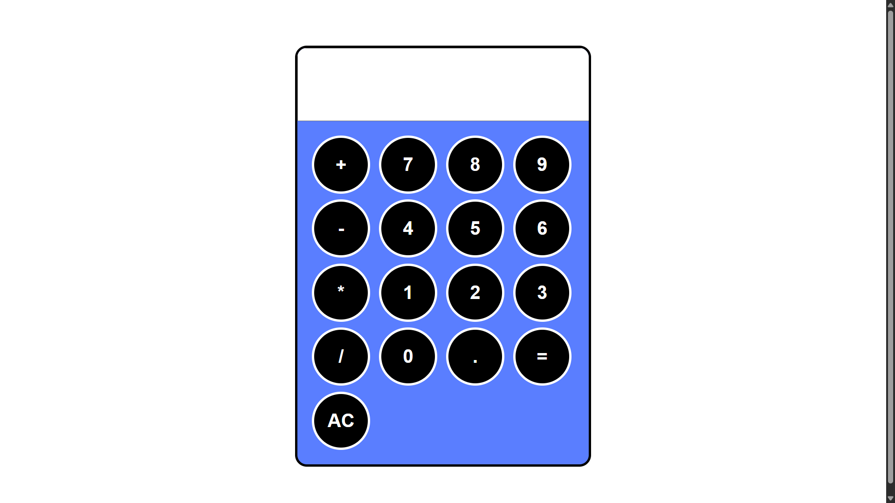

# Simple Calculator

A basic calculator using HTML, CSS, and JavaScript.

## How it Works
- Calculator logic is handled with JavaScript functions.
- Event listeners are used for button interactions.
- Errors (like invalid expressions) are prevented using try-catch logic.

## Preview

## Usage
Open `index.html` in your browser and use the calculator.
 