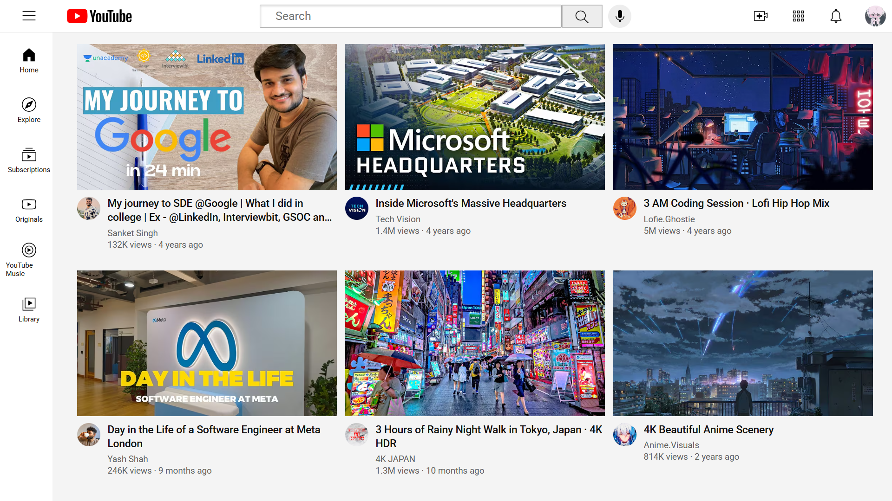

# YouTube Homepage UI 

✨ A simple YouTube homepage UI built with **HTML & CSS**
✨ Focus: practicing layouts with Flexbox & Grid.  

## 📂 Project Structure
- **CSS/** – Stylesheets  
- **Channel Profile Images/** – Youtube Channels
- **Icons/** – Icons used  
- **Thumbnails/** – Images for video thumbnails  
- **index.html** – Main page  
- **README.md** – Documentation  

## 📖 Learning Goals
- Practice **Flexbox** for responsive layouts  
- Understand **CSS Grid** for video gallery  
- Learn **basic project structuring**

## 🛠️ Tech Stack
- HTML5  
- CSS3

## ✨Credits 
- This UI was built by following **SuperSimpleDev's**  & MDN Web Docs (https://developer.mozilla.org/en-US/). Not an original project just for practice. 

## 📸 Preview

<video src="Sweet_UI_Preview.mp4" controls width="500">
  Your browser does not support the video tag.
</video>